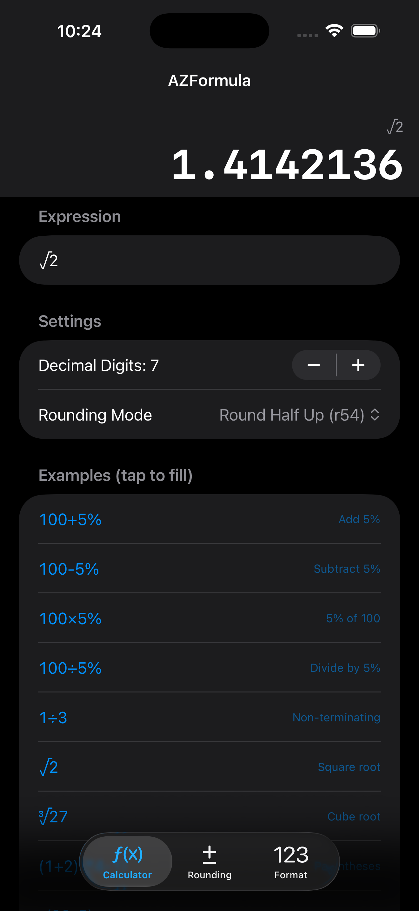
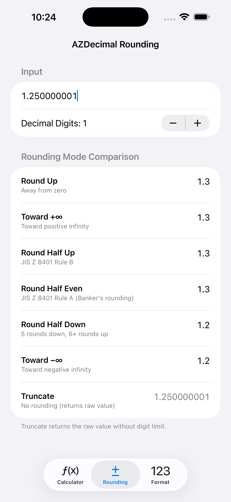
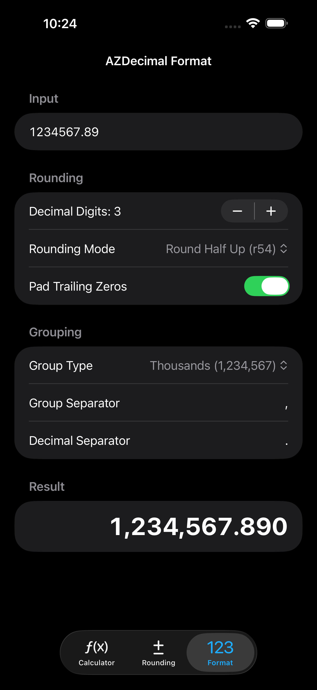

# AZCalc

BCD decimal arithmetic and formula evaluation for Swift.


**Documentation:** [English](https://docs.azukid.com/en/sumpo/AZCalc/azcalc.html) · [日本語](https://docs.azukid.com/jp/sumpo/AZCalc/azcalc.html)

Two products in one package:

| Product | Description |
|---|---|
| **AZDecimal** | Signed BCD decimal arithmetic — 60-digit precision, 7 rounding modes |
| **AZFormula** | Formula string evaluator — parses and evaluates infix expressions |

## Demo

<p>
  
  &nbsp;
  
  &nbsp;
  
</p>

---

## AZDecimal

Floating-point-free arithmetic using Binary Coded Decimal (BCD).
Up to 30 integer digits + 30 decimal digits (60 digits total).

> **Changing precision:** `SBCD_PRECISION` is defined with a `#ifndef` guard in `Sources/AZDecimalC/include/SBCD.h`. When forking the package, you can override it via a build flag (`-DSBCD_PRECISION=120`). The value must be **even**. The upper bound is limited by stack consumption of the fixed-size C array (`char digit[SBCD_PRECISION+1]`).

### Basic usage

```swift
import AZDecimal

let a: AZDecimal = "1.1"
let b: AZDecimal = "2.0456"
print(a + b)   // "3.1456"
print(a - b)   // "-0.9456"
print(a * b)   // "2.25016"
print(a / b)   // "0.537815..."
```

### Convenience API

```swift
AZDecimal.zero          // AZDecimal("0")
AZDecimal.one           // AZDecimal("1")

let x: AZDecimal = "-3.14"
x.isZero                // false
x.isNegative            // true
x.abs                   // AZDecimal("3.14")

var a: AZDecimal = "10"
a += "3"   // 13
a -= "5"   // 8
a *= "2"   // 16
a /= "4"   // 4
```

### Invalid values (NaN) <sub>(2.0.0+)</sub>

Division by zero and overflow produce a NaN value, following `Double` semantics.
Prior to 2.0.0 these returned the internal `"-0"` sentinel string.

```swift
let bad = AZDecimal("1") / AZDecimal("0")
bad.isNaN               // true
bad == bad              // false — NaN is never equal to itself
(bad + AZDecimal("1")).isNaN  // true — NaN propagates through operations
```

### Rounding

`decimalDigits` accepts values from `0` through `AZDecimalConfig.maxDecimalDigits`
(30 by default, derived from `SBCD_PRECISION / 2`). Values below `0` are clamped
to `0`, and values above the maximum are clamped to the maximum. Rounding can
therefore preserve the full 30 decimal digits supported by the default BCD core.

```swift
let config = AZDecimalConfig(decimalDigits: 2, roundType: .r54)
let result = AZDecimal("3.456").rounded(config)
print(result)  // "3.46"
```

### Rounding modes

| Mode | Name | Description | Standard |
|---|---|---|---|
| `.rup` | Round Up | Round away from zero | — |
| `.rPlus` | Round toward +∞ | Round toward positive infinity | IEEE 754: roundTowardPositive |
| `.r54` | Round Half Up | Round half up | JIS Z 8401 Rule B |
| `.r55` | Round Half Even | Round half to even — Banker's rounding | JIS Z 8401 Rule A · IEEE 754: roundTiesToEven |
| `.r65` | Round Half Down | 5 rounds down, 6+ rounds up | — |
| `.rMinus` | Round toward −∞ | Round toward negative infinity | IEEE 754: roundTowardNegative |
| `.truncateToDigits` <sub>(2.0.0+)</sub> | Truncate to digits | Truncate the value to `decimalDigits` | IEEE 754: roundTowardZero |
| `.keepFull` <sub>(2.0.0+)</sub> | Keep full | No rounding — return the raw value at full precision | — |

`.keepFull` is useful when you want to **preserve full precision through chained calculations** and let display-time `formatted(_:)` handle digit truncation — e.g. a calculator accumulator that must not accumulate rounding error across steps.

> **Renamed in 2.0.0:** the former `.truncate` mode is split into `.truncateToDigits` (truncates the value) and `.keepFull` (no rounding). The old `.truncate` behaved like `.keepFull`.

### Formatting

`formatted(_:)` applies grouping separators, decimal separator, and trailing-zero padding.
It also truncates the decimal part to `decimalDigits`. Call `rounded(_:)` first for precise rounding.

```swift
let config = AZDecimalConfig.default
    .digits(2)
    .rounding(.r54)
    .trailingZero(true)
    .grouping(.threes)

let value = AZDecimal("1234567.045")
print(value.rounded(config).formatted(config))
// "1,234,567.05"
```

### Fluent configuration

`AZDecimalConfig` supports method chaining. The default config uses `.r54`, 3 decimal digits, 3-digit grouping, no trailing zeros.

```swift
// verbose style
var config = AZDecimalConfig()
config.decimalDigits = 2
config.roundType = .r54

// fluent style (equivalent)
let config = AZDecimalConfig.default.digits(2).rounding(.r54)
```

| Method | Description |
|---|---|
| `.digits(_ n: Int)` | Set decimal digits, clamped to `0...AZDecimalConfig.maxDecimalDigits` |
| `.rounding(_ type: RoundType)` | Set rounding mode |
| `.trailingZero(_ enabled: Bool)` | Pad / strip trailing zeros |
| `.grouping(_ type: GroupType, separator: String)` | Set digit grouping |
| `.decimalSep(_ separator: String)` | Set decimal separator |

### Grouping types

| Type | Example |
|---|---|
| `.none` | `1234567` |
| `.threes` | `1,234,567` |
| `.fours` | `123,4567` |
| `.indian` | `12,34,567` |

---

## AZFormula

Evaluates infix formula strings using the Shunting Yard algorithm.

### Basic usage

```swift
import AZFormula

let result = AZFormula.evaluate("(100 + 5%) × 1.08")
// → .success("113.4")

switch AZFormula.evaluate("1 ÷ 3") {
case .success(let value): print(value)  // "0.333"  (default: .r54, 3 digits)
case .failure(let error): print(error)
}
```

### With rounding config

```swift
let config = AZDecimalConfig.default.digits(2).rounding(.r54)

let result = AZFormula.evaluate("1 ÷ 3", config: config)
// → .success("0.33")
```

### evaluateDecimal — returns AZDecimal

When you need to perform further arithmetic on the result:

```swift
if case .success(let a) = AZFormula.evaluateDecimal("10+5"),
   case .success(let b) = AZFormula.evaluateDecimal("2+1") {
    print(a * b)  // AZDecimal("45")
}
```

### Supported operators

| Operator | Description |
|---|---|
| `+` `-` `×` `÷` | Basic arithmetic (`*` `/` also accepted) |
| `√` | Square root — BCD Newton-Raphson, full precision |
| `∛` | Cube root — BCD Newton-Raphson, full precision |
| `( )` | Parentheses |
| `%` | Percent — context-sensitive (see below) |
| `割` `分` `厘` | Japanese percent notation |

### Percent operator behavior

| Expression | Expands to | Result |
|---|---|---|
| `100+5%` | `100×(100+5)÷100` | `105` |
| `100-5%` | `100×(100-5)÷100` | `95` |
| `100×5%` | `100×5÷100` | `5` |
| `100÷5%` | `100÷5×100` | `2000` |

### Error cases

```swift
public enum AZFormulaError: Error {
    case tooLong          // formula exceeds AZFormula.maxFormulaLength characters (default: 200, settable at runtime)
    case negativeSqrt     // √ applied to a negative number
    case zeroDivision     // division by zero          (2.0.0+)
    case overflow         // exceeded the precision digit limit  (2.0.0+)
    case invalidExpression
}
```

### Sub-step API (for testing / custom pipelines)

```swift
let tokens = AZFormula.tokenize("100+5%")
// ["100", "×", "(", "100", "+", "5", ")", "÷", "100"]

let rpn = AZFormula.toRPN(tokens)
// ["100", "100", "5", "+", "×", "100", "÷"]
```

---

## Installation

### Swift Package Manager

In Xcode: **File → Add Package Dependencies**

```
https://github.com/SumPositive/AZCalc
```

Or add to your `Package.swift`:

```swift
dependencies: [
    .package(url: "https://github.com/SumPositive/AZCalc", from: "2.0.0")
]
```

Add products to your target:

```swift
.target(
    name: "MyApp",
    dependencies: [
        .product(name: "AZDecimal", package: "AZCalc"),
        .product(name: "AZFormula", package: "AZCalc"),
    ]
)
```

## Requirements

- iOS 16.0+ / macOS 13.0+
- Swift 5.9+
- Xcode 15+

---

## Development

```
AZCalc/
├── Package.swift
├── Sources/
│   ├── AZDecimalC/          ← BCD arithmetic core (C++)
│   ├── AZDecimal/           ← Swift API
│   └── AZFormula/           ← Formula engine
├── Tests/
│   ├── AZDecimalTests/      ← 51 tests (arithmetic, rounding, comparable, convenience, format, root)
│   └── AZFormulaTests/      ← 46 tests (tokenize, RPN, evaluate, evaluateDecimal)
└── Demo/
    └── AZCalcDemo.xcodeproj ← SwiftUI demo app (iOS 17+)
```

Open `AZCalc.xcworkspace` in Xcode to run both package tests and demo app tests together.

### Xcode Project Management

XcodeGen is not permitted in this repository. Do not add or use `project.yml`,
`project.yaml`, or other project-generation configurations. Create and update
`.xcodeproj` and `.xcworkspace` files directly in Xcode, and commit those Xcode-managed
files when project settings or file references change.

### AZDecimalC — Implementation Notes

**Division algorithm (sbcAbsDivid)**

The quotient digit at each position is found by *counting how many times the divisor can be subtracted* before the remainder goes negative (linear search, 0–9 iterations). An alternative is trial quotient estimation using the divisor's leading digit, which reduces the inner loop to at most 3 iterations (~3× faster). It was not adopted for the following reasons:

1. **Correctness** — linear search always produces the exact digit with no estimation-error correction logic needed.
2. **Simplicity** — the implementation is short and easy to audit.
3. **Performance** — worst-case cost is 60 digits × 10 iterations × 60 char operations = 36,000 operations, which completes in microseconds on any modern device. This is sufficient for a calculator application.

If `SBCD_PRECISION` is increased significantly (e.g. 240+) and division latency becomes measurable, trial quotient estimation would be the natural next step.

## License

MIT License. See [LICENSE](LICENSE) for details.
